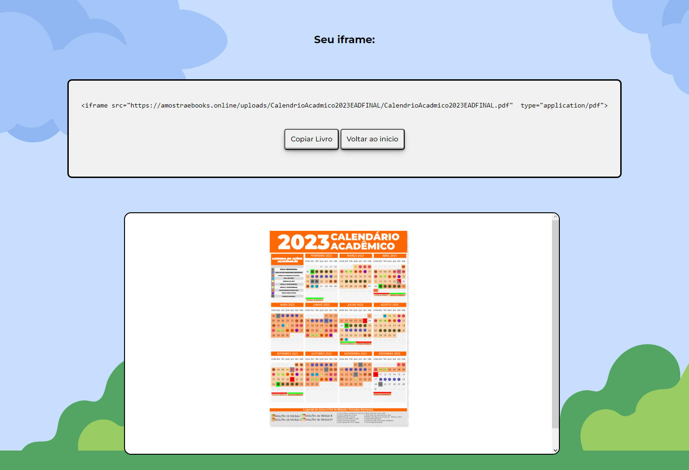

# Gerador de FlipEbooks para PDFS


 
Gerador de FlipEbooks para PDFS:
> O site tem como objetivo Transformar Pdfs padroes em uma visualização em revista. A pessoa upando um arquivo pdf estara transformando ele em uma visualização em formato revista usando a biblioteca JavaScript DFlip. Caso a pessoa queira usar esse pdf em um layout o site gera um iframe compartilhado aonde através do link ela pode ter acesso a esse pdf já modificado. 

## 💻 Pré-requisitos

Antes de começar, verifique se você atendeu aos seguintes requisitos:

* Você instalou a versão mais recente do `<NodeJS / MySQL>`
* Você tem uma máquina `<Windows / Linux / Mac>`.
  
## 🚀 Instalando Site de suporte

Para instalar o Gerador, siga estas etapas:

> Abra o terminal no diretório raiz do projeto e digite:
```
npm i
```
```
npm start
```
 
## ☕ Usando Site de suporte

Para usar o Site de suporte, siga estas etapas:
>Após a instalação das dependêcias você pode navegar até o endereço LOCALHOST:3000:


## 🤝 Colaboradores

Agradecemos às seguintes pessoas que contribuíram para este projeto:

<table>
  <tr>
    <td align="center">
      <a href="https://github.com/Messiaslogia">
        <br>
        <sub>
          <b>Messias G</b>
        </sub>
      </a>
    </td>
  </tr>
</table>

## 📝 Licença

Esse projeto está sob licença. Veja o arquivo [LICENÇA](LICENSE.md) para mais detalhes.
